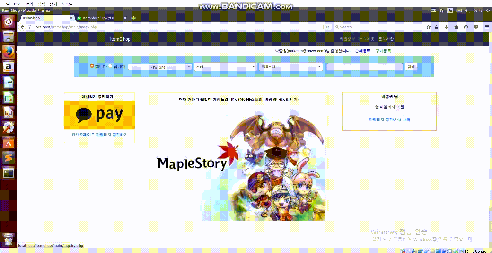

php로 사이트를 2개를 만들었는데
 
 **작품 플레이 영상**
=======================================

**만들게 된 계기 및 간단 소감**
=======================================
1. 팀노바라고 하는 코딩교육기관을 다니면서 거기에서 가르치는 PHP를 따라하며 5+5=10주정도의 시간동안 만들었음. (언어교환 사이트, 아이템거래 사이트 2개 만들었기 때문에 10주) 
2. 처음 PHP을 배워서 만든 작품. 
3. 개발 기잔 :2018년 2월 ~ 2018년 3월(언어교환사이트-포함된코드에 해당하는 부분 시연영상 없음 : 해당 사이트와 비슷함) + 2018년 4월 ~ 2018년 5월(아이템거래사이트-시연영상에 해당하는 부분, 관련 코드가 포함되지 않음, 이유 : VirtualBox에서 개발했는데 VirtualBox를 생각없이 지우는 바람에 개발 코드가 날라감.)
(다시한번 얘기하지만, 시연영상과 코드는 같지 않음. 아이템거래사이트 제작물은 언어교환)
4. 리눅스, APM설치, Get,Post의 개념, http의 개념, 부트스트랩의 개념, 카카오톡 결제모듈 추가 등 여러가지 개념을 종합적으로 공부해볼 수 있었음.
5. 특히 UI를 설계하는게 아주 힘들었음. 안드로이드는 XML로 쉽게 만들 수 있었는데, 홈페이지는 정말 만들기 힘들다는 것 깨달았음.

**기능 소개**
======================================
(언어교환 사이트 - 코드 있음 - 시연영상 없음)
1. 회원가입
2. 로그인
3. 사진 첨부해서 글올리기, 글 수정, 삭제, 읽기

(아이템 거래 사이트 - 코드 없음 - 시연영상만 있음)
1. 회원가입
2. 로그인
3. 비밀번호 찾기
4. 회원정보 수정
5. 문의하기
6. 게시글 추가, 수정, 삭제, 검색(이미지 첨부)
7. 카카오톡 결제